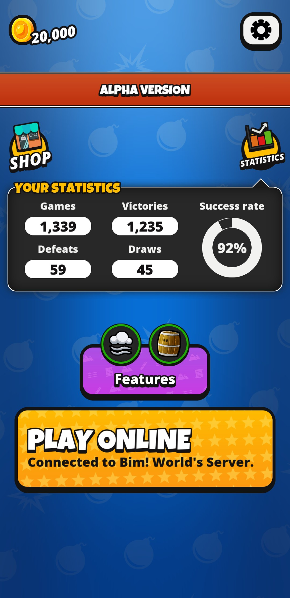
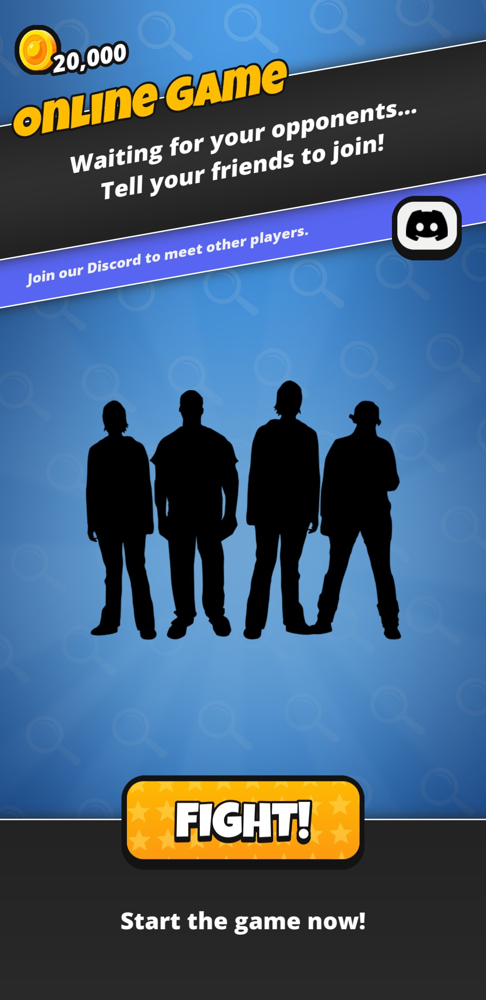
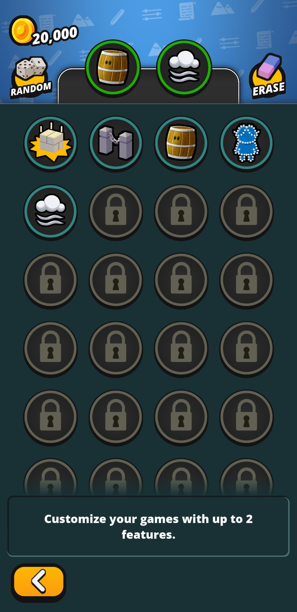
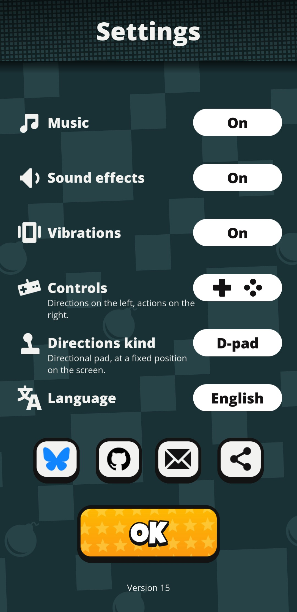

# Bim!

Bim! is an open-source multiplayer online mobile game of the
last man standing genre.

  

Up to four players are stuck in a small arena with a single goal: be
the last person standing. The players can drop bombs to destroy the
walls or, ultimately, attack another player. Sometimes the broken
walls will expose a bonus such as extra bombs or an increase of the
bombs' blast distance.

The match features can be selected from the matchmaking screen. It is
enough of one player enabling a feature for all players benefiting
from it during the contest.

  
  

  
  

  
  

# Installing

The game is available for Android devices but still in beta on the
PlayStore. In order to install it you can download the APK from [the
releases page](https://github.com/j-jorge/bim/releases/latest) or get
it from alternative stores.

# License

The game is fully open-source. The code is available under the terms
of the GNU Affero General Public License 3.0 (GNU/AGPLv3) and most
assets (sounds, graphics) are licensed under the terms of the Creative
Common attribution-share-alike 4.0 license (CC by-sa 4.0). Some assets
use other free licenses, see [AUTHORS.md](AUTHORS.md) for details.

You can take the code or the assets, do whatever you want with them,
as long as you make your changes publicly available under the same
terms.

# Contributing

Want to take part in the project? Let's begin with [the developer's
guide](docs/developers.md).

Translations can be worked on using
[Weblate](https://hosted.weblate.org/projects/bim/).
