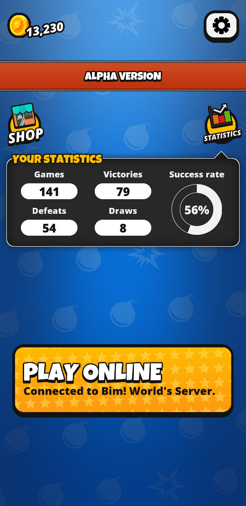

# Bim!

Bim! is an open-source online multiplayer mobile game of the
last man standing genre.

  

Up to four players are stuck in a small arena with a single goal: be
the last person standing. The players can drop bombs to destroy the
walls or, ultimately, attack another player. Sometimes the broken
walls will expose a bonus such as extra bombs or an increase of the
bombs' blast distance.

The match features can be selected from the matchmaking
screen. Features enabled by all participants will be used in the game,
allowing players to customize their contest.

  
  

  
  

  

# Installing

The game is available for Android devices but not yet in the
stores. In order to install it you must download the APK from [the
releases page](https://github.com/j-jorge/bim/releases/latest).

# License

The game is fully open-source. The code is available under the terms
of the GNU Affero General Public License 3.0 (GNU/AGPLv3) and most
assets (sounds, graphics) are licensed under the terms of the Creative
Common attribution-share-alike 4.0 license (CC by-sa 4.0). Some assets
use other free licenses, see [AUTHORS.md](AUTHORS.md) for details.

You can take the code or the assets, do whatever you want with them,
as long as you make your changes publicly available under the same
terms.
